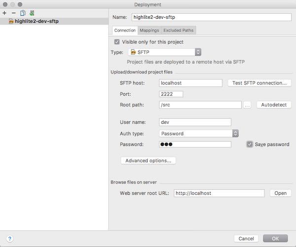

## Highlite Spb

[Highlite Spb](http://highlite-spb.ru) is a show equipment store. It is a eCommerce project, consisting of two parts:
- [highlite2-sylius](https://github.com/oliosinter/highlite2-sylius) - online store, based on [Sylius](https://sylius.com) eCommerce framework;
- [highlite2-import](https://github.com/oliosinter/highlite2-import) - product import tool, written in Golang;
- [highlite2-jenkins](https://github.com/oliosinter/highlite2-jenkins) - continuous delivery.

## Highlite2-Sylius
Highlite2-sylius is based on [Sylius Standard Edition](https://github.com/Sylius/Sylius-Standard).

### Project structure
- `ci/` release and deploy settings;
- `dev/` local development environment settings;
- `docs/` documentation files;
- `sylius/` Sylius Standard Edition.

### Local Development

#### Requirements:
In order to run **highlite2-sylius** locally you need to have `docker` and `docker-compose` installed. 

#### Commands:
- `make dev-build` Builds local environment from scratch. You must use this command when you start local environment for the first time or when you want to fully recreate it.
- `make dev-restart` Rebuilds php-fpm, nginx and sftp containers. Keeps untouched the database and media files.
- `make dev-start` Starts the environment after it had been stopped by `make dev-stop` command.
- `make dev-stop` Stops local environment. You can easily start it again with `make dev-start` command.
- `make dev-clean` Totally removes local environment but keeps untouched composer cache volume.
- `make dev-bash-node` Runs `bash` in a container with node and yarn installed, with mounted codebase volume and under `www-data` user.
- `make dev-bash-php` Runs `bash` in a container with php and composer installed, with mounted codebase volume and under `www-data` user.

Project codebase from `sylius` folder is placed in a volume. All services that need to have access to the codebase mount project folder to that volume.
In order to develop locally and to update your code in a real time there is a sftp container that also mounts the codebase volume. You can setup
automatic deployment using following credentials:
- **hostname** localhost
- **port** 2222
- **user** dev
- **password** dev

#### Why not bind mounting application directory?
Sylius has a lot of dependencies and as a result `vendor` folder is very large. Docker has a performance issue with
large directories that are bind-mounted with osxfs. From [official documentation](https://docs.docker.com/docker-for-mac/troubleshoot/#known-issues):
```
There are a number of issues with the performance of directories bind-mounted with osxfs. 
In particular, writes of small blocks, and traversals of large directories are currently slow. 
Additionally, containers that perform large numbers of directory operations, such as repeated 
scans of large directory trees, may suffer from poor performance. Applications that behave in 
this way include:

- rake
- ember build
- Symfony
- Magento
- Zend Framework
- PHP applications that use Composer to install dependencies in a vendor folder

As a work-around for this behavior, you can put vendor or third-party library directories in 
Docker volumes, perform temporary file system operations outside of osxfs mounts, and use 
third-party tools like Unison or rsync to synchronize between container directories and 
bind-mounted directories. We are actively working on osxfs performance using a number of 
different techniques. To learn more, see the topic on Performance issues, solutions, and roadmap.
```
More related links:
- https://stackoverflow.com/questions/38163447/docker-mac-symfony-3-very-slow
- http://blog.michaelperrin.fr/2017/04/14/docker-for-mac-on-a-symfony-app/

**Solution:** there were several problems with changing project structure and moving vendor folder outside. 
So, it was decided to keep codebase in a volume and to have access to the code through sftp.

#### PHPStorm deployment settings example:
##### Connection

##### Mappings

